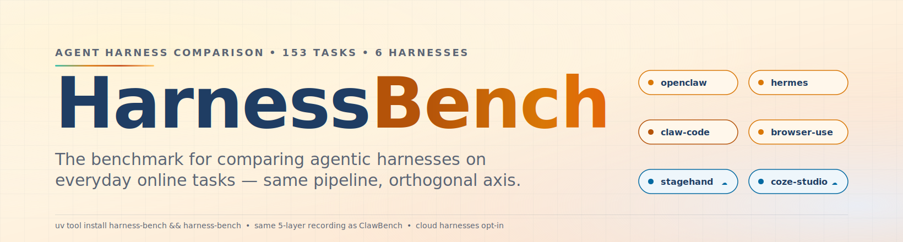
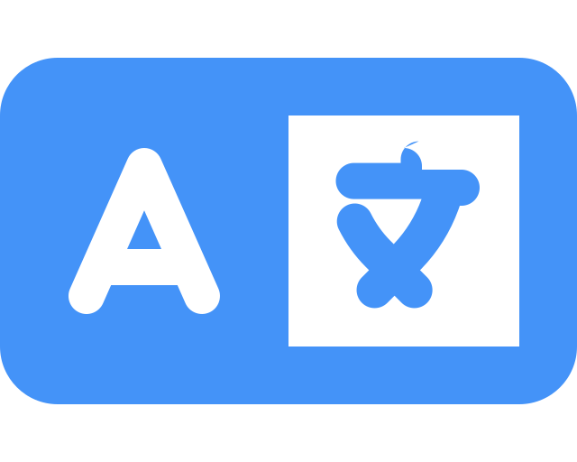
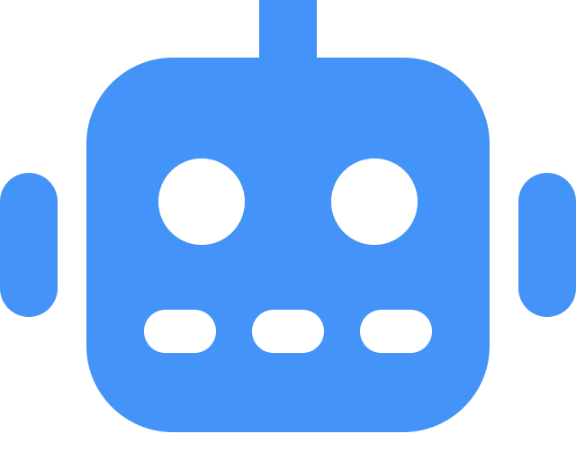
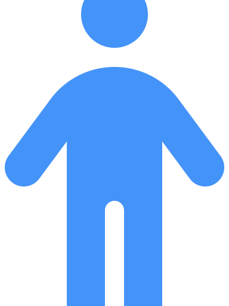
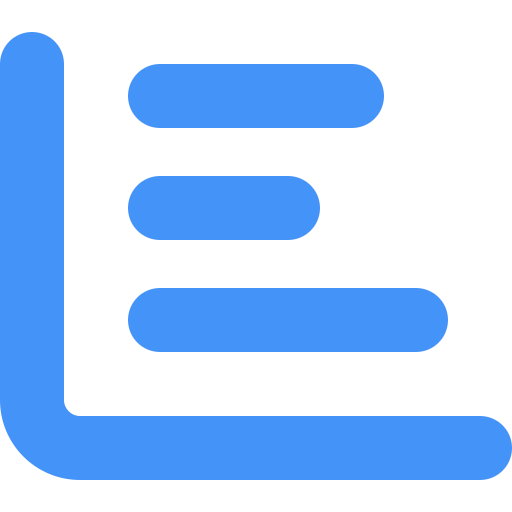
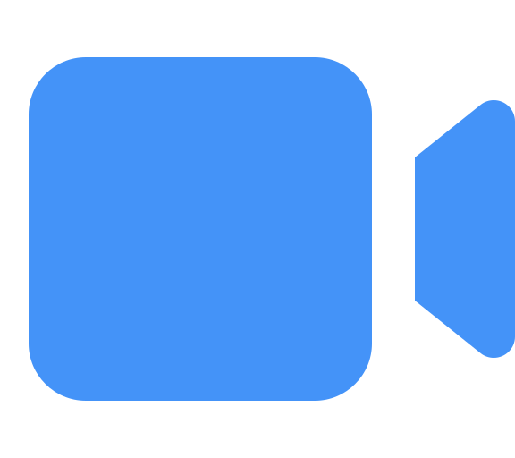
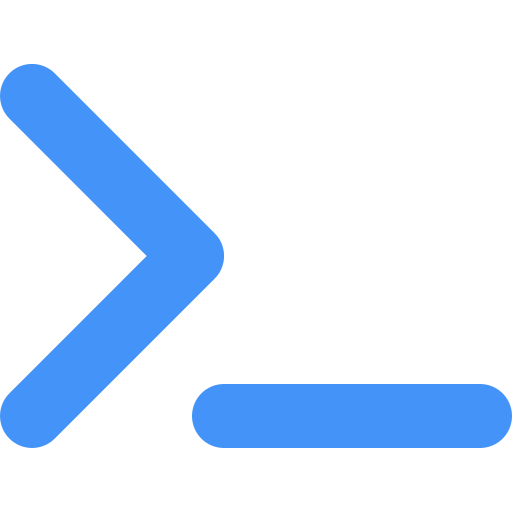

<div align="center">

<a href="https://github.com/reacher-z/HarnessBench">
  <picture>
    <source media="(prefers-color-scheme: dark)" srcset="static/hero-dark.svg">
    
  </picture>
</a>

<p align="center">
  <strong>The Benchmark for Comparing Agent Harnesses on Everyday Online Tasks</strong><br>
  <a href="docs/adding-a-harness.md">Read the Docs</a>
  &nbsp;·&nbsp;
  <a href="docs/harness-comparison.md">Harness Comparison</a>
  &nbsp;·&nbsp;
  <a href="docs/cloud-harness-setup.md">Cloud Setup</a>
</p>

<p align="center">
  <a href="https://github.com/reacher-z/HarnessBench"></a>
  <a href="https://harness-eval.com"></a>
  <a href="https://github.com/reacher-z/HarnessBench"></a>
  <a href="https://discord.gg/clawbench"></a>
  <a href="https://codespaces.new/reacher-z/HarnessBench?quickstart=1"></a>
</p>

<p align="center">
  <a href="https://github.com/reacher-z/ClawBench"></a>
</p>

<p align="center">
  <a href="https://deepwiki.com/reacher-z/HarnessBench"></a>
</p>

<p align="center">
  If you want to compare <i>base models</i> on a fixed harness, check out our sister project
  <a href="https://github.com/reacher-z/ClawBench"><b>ClawBench</b></a>
  &nbsp;&mdash;&nbsp; same pipeline, orthogonal axis.
</p>

<a href="#-human-quick-start"></a>

```bash
uv tool install harness-bench && harness-bench
```

<sub><i>Install &rarr; List &rarr; Run. &nbsp; Reuses ClawBench's pipeline. &nbsp; Cloud harnesses opt-in via env vars.</i></sub>

### Which Harness Wins on the Same Task?

Given one task (order food, book travel, apply for a job) and **one fixed base model** --<br/>
which agentic harness actually gets it done?<br/>
**Six named harnesses**, four runtimes, one pipeline, one leaderboard.

---

**6** harnesses &nbsp;&middot;&nbsp; **4** runtimes (Python / Node / Rust / Web) &nbsp;&middot;&nbsp; **153** shared tasks &nbsp;&middot;&nbsp; **15** categories

<a href="README.zh-CN.md"> 中文</a>

</div>

<br/>

<p align="center">
&nbsp;<b>Plugin Entry-Points</b>
&nbsp;&nbsp;&nbsp;&nbsp;&nbsp;&nbsp;
&nbsp;<b>One Container per Harness</b>
&nbsp;&nbsp;&nbsp;&nbsp;&nbsp;&nbsp;
&nbsp;<b>Cloud Opt-in</b>
&nbsp;&nbsp;&nbsp;&nbsp;&nbsp;&nbsp;
&nbsp;<b>Same Pipeline as ClawBench</b>
</p>

<br/>

## How It Works

```
   You pick a task            HarnessBench spins up        Each harness drives       Same 5-layer recording
   from ClawBench's           one container per            the browser its own       + DOM-match + LLM judge
   shared 153-task pool       harness (Python / Node       way on the same task      partitioned by harness
                              / Rust / Web)

   ┌──────────────┐           ┌──────────────┐           ┌──────────────┐           ┌──────────────┐
   │  "Book a     │    ──►    │  6 containers│    ──►    │  6 different │    ──►    │  Per-harness │
   │   flight on  │           │  (one per    │           │  agent loops │           │  leaderboard │
   │   Expedia"   │           │   harness)   │           │  same task   │           │  by category │
   └──────────────┘           └──────────────┘           └──────────────┘           └──────────────┘
```

<br/>

#  LLM Quick Start

Point your coding agent (Claude Code, Cursor, Copilot, etc.) at [`AGENTS.md`](AGENTS.md) and prompt away. HarnessBench shares ClawBench's test-cases, container base image, and 5-layer recording stack -- if your agent already knows ClawBench, there is nothing new to learn about the pipeline, only a new harness axis.

<br/>

#  Human Quick Start

```bash
# Option A -- PyPI install (recommended)
uv tool install harness-bench && harness-bench
```

```bash
# Option B -- Clone the repo (for contributors / adding a harness)
git clone https://github.com/reacher-z/HarnessBench.git && cd HarnessBench && uv run harness-bench
```

**Prerequisites:** [Python 3.10+](https://python.org), [uv](https://docs.astral.sh/uv/), and a container engine -- [Docker](https://www.docker.com/) **or** [Podman](https://podman.io/). Same engine detection as ClawBench; force one with `export CONTAINER_ENGINE=docker`.

**1. List registered harnesses:**

```bash
harness-bench harnesses
# openclaw       ready
# hermes         ready
# claw-code      ready
# browser-use    ready
# stagehand      skipped: set BROWSERBASE_API_KEY
# coze-studio    skipped: set COZE_INSTANCE_URL, COZE_API_TOKEN
```

**2. Preview a matrix** (no side effects):

```bash
harness-bench matrix \
    --harness openclaw --harness hermes --harness browser-use \
    --model   claude-sonnet-4-6 \
    --case    001-daily-life-food-uber-eats \
    --case    007-daily-life-travel-expedia
```

**3. Run one triple end-to-end:**

```bash
harness-bench run \
    --harness openclaw \
    --model   claude-sonnet-4-6 \
    --case    001-daily-life-food-uber-eats
```

Results land in `./harness-output/<harness>/<model>/<case>-<timestamp>/` with the full five-layer recording -- identical layout to ClawBench so a single analysis script handles both.

**4. Matrix batch** (all eligible triples):

```bash
harness-bench batch \
    --harness openclaw --harness hermes --harness browser-use --harness claw-code \
    --model   claude-sonnet-4-6 \
    --case    $(cat fixtures/lite.txt)
```

**5. Render the leaderboard:**

```bash
harness-bench leaderboard --results-dir ./harness-output/
```

<br/>

#  HarnessBench-Lite

**New here? Run this first.** [`fixtures/lite.txt`](fixtures/lite.txt) is a **20-task curated subset** of ClawBench's 153, reused verbatim so HarnessBench-Lite and ClawBench-Lite are comparable row-for-row. It matches the 20-tasks-per-source convention of [browser-use/benchmark](https://github.com/browser-use/benchmark) and gives you a credible harness-vs-harness signal at a fraction of the full-matrix cost.

For six harnesses on Lite you're looking at roughly **120 triples** (6 harnesses x 20 tasks); cloud-opt-in harnesses auto-skip if credentials are absent so the local-only cost is **80 triples**.

```bash
harness-bench batch \
    --harness openclaw -h hermes -h browser-use -h claw-code \
    --model   claude-sonnet-4-6 \
    --case    $(cat fixtures/lite.txt)
```

<br/>

#  Tutorial

<div align="center">

<!-- TODO: Replace with actual video links -->

[](https://youtube.com)
&nbsp;&nbsp;
[](https://bilibili.com)

</div>

<br/>

#  Demos

<!-- TODO: Replace with actual demo GIFs/recordings -->

<table>
<tr>
<td width="50%" align="center">

**`openclaw` on Uber Eats**

https://github.com/user-attachments/assets/placeholder-openclaw-ubereats

</td>
<td width="50%" align="center">

**`browser-use` on the same Uber Eats task**

https://github.com/user-attachments/assets/placeholder-browseruse-ubereats

</td>
</tr>
</table>

> Each HarnessBench run produces the same MP4 session recording ClawBench does. Pair-watching the same task across two harnesses is the fastest way to see where their behavior diverges.

<br/>

#  The Six Named Harnesses

| Harness | Upstream | Runtime | Cloud? | What it is |
|---------|----------|:-------:|:------:|------------|
| `openclaw` | [reacher-z/ClawBench](https://github.com/reacher-z/ClawBench) | Python | &mdash; | Reference harness, shared with ClawBench. The baseline everyone gets compared against. |
| `hermes` | [nousresearch/hermes-agent](https://github.com/nousresearch/hermes-agent) | Python | &mdash; | Hermes-style tool-use loop with explicit plan/act steps. |
| `claw-code` | [ultraworkers/claw-code](https://github.com/ultraworkers/claw-code) | Rust | &mdash; | Rust-native agent loop, zero-GIL concurrency. |
| `browser-use` | [browser-use/browser-use](https://github.com/browser-use/browser-use) | Python | &mdash; | Community-favorite Playwright-based harness. |
| `stagehand` | [browserbase/stagehand](https://github.com/browserbase/stagehand) | Node/TS | **Yes** | BrowserBase's Stagehand -- requires `BROWSERBASE_API_KEY`. |
| `coze-studio` | [coze-dev/coze-studio](https://github.com/coze-dev/coze-studio) | Web | **Yes** | Coze Studio flow runner -- requires `COZE_INSTANCE_URL` + `COZE_API_TOKEN`. |

Cloud harnesses are **opt-in**: without credentials they appear in the matrix as `skipped:missing_credential:<VAR>` -- **never silently zeroed**. More harnesses land as follow-up PRs; see [`docs/scout-2026-04-16.md`](docs/scout-2026-04-16.md) for the global framework sweep.

<br/>

#  Preview Leaderboard

<div align="center">

**Work in progress.** Initial runs on `claude-sonnet-4-6` across the six harnesses are in flight -- numbers below are placeholders illustrating the leaderboard shape.

</div>

| Rank | Harness | Overall | Daily | Travel | Work | Dev | Notes |
|:----:|---------|:-------:|:-----:|:------:|:----:|:---:|-------|
| &mdash; | `openclaw` | TBD | TBD | TBD | TBD | TBD | reference harness (ClawBench) |
| &mdash; | `hermes` | TBD | TBD | TBD | TBD | TBD | Python tool-use loop |
| &mdash; | `claw-code` | TBD | TBD | TBD | TBD | TBD | Rust agent loop |
| &mdash; | `browser-use` | TBD | TBD | TBD | TBD | TBD | Playwright-based |
| &mdash; | `stagehand` | TBD | TBD | TBD | TBD | TBD | cloud-opt-in |
| &mdash; | `coze-studio` | TBD | TBD | TBD | TBD | TBD | cloud-opt-in |

<sub><i>Partitioning: <code>(harness, model, category)</code>. Run <code>harness-bench leaderboard</code> locally to render your own.</i></sub>

<br/>

#  Example Walkthrough

Curious what one triple actually looks like? Here's **task 001** run through **three different harnesses**, same base model:

```
task    = 001-daily-life-food-uber-eats
model   = claude-sonnet-4-6

harness = openclaw      ──►  ./harness-output/openclaw/claude-sonnet-4-6/001-.../
                             (Python loop driving Chrome via the ClawBench extension)

harness = hermes        ──►  ./harness-output/hermes/claude-sonnet-4-6/001-.../
                             (Python loop, Hermes tool-use convention)

harness = browser-use   ──►  ./harness-output/browser-use/claude-sonnet-4-6/001-.../
                             (Playwright driver + atomic action primitives)
```

All three land the **same five-layer bundle** (recording.mp4, screenshots, actions.jsonl, requests.jsonl, agent-messages.jsonl) plus `interception.json` from ClawBench's CDP-level fetch interceptor. That uniformity is what makes cross-harness comparison meaningful: identical inputs, identical judge, identical rubric -- the only thing that moves between runs is the agent loop itself.

<br/>

#  Architecture

<details>
<summary>How HarnessBench stacks on top of ClawBench</summary>

```
 ┌─────────────────────────────────────────────────────────┐
 │  harness-bench CLI                                      │
 │  (matrix expansion, credential gating, leaderboard)     │
 └───────────────────────┬─────────────────────────────────┘
                         │
                         ▼
 ┌─────────────────────────────────────────────────────────┐
 │  clawbench.harnesses  (plugin entry-point group)        │
 │  discovered at runtime via importlib.metadata           │
 └───────────────────────┬─────────────────────────────────┘
                         │
          ┌──────────────┼──────────────┬──────────────┐
          ▼              ▼              ▼              ▼
      openclaw         hermes        claw-code      browser-use      stagehand      coze-studio
      (Python)         (Python)      (Rust)         (Python)         (Node/TS)      (Web)
      dedicated        dedicated     dedicated      dedicated        dedicated      dedicated
      container        container     container      container        container      container
          │              │              │              │              │              │
          └──────────────┴──────────────┴──────────────┴──────────────┴──────────────┘
                                                 │
                                                 ▼
 ┌─────────────────────────────────────────────────────────┐
 │  clawbench/base:<version>                               │
 │  (Chrome + Xvfb + FFmpeg + extension-server + CDP wire) │
 │  Same image ClawBench uses -- zero drift.               │
 └─────────────────────────────────────────────────────────┘
```

Each harness ships its own `Dockerfile` (3-file adapter: `Dockerfile` + `setup.sh` + `run.sh`) that `FROM clawbench/base:<version>` so the shared stack is byte-for-byte identical across harnesses. See [`docs/adding-a-harness.md`](docs/adding-a-harness.md) for the walkthrough.

</details>

<br/>

#  CLI

```bash
# List and gate
harness-bench harnesses

# Matrix preview (no side effects)
harness-bench matrix --harness openclaw -h hermes -m claude-sonnet-4-6 -c 001-daily-life-food-uber-eats

# Single run
harness-bench run --harness openclaw --model claude-sonnet-4-6 --case 001-daily-life-food-uber-eats

# Batch (matrix-expand, skip ineligible, run the rest)
harness-bench batch -h openclaw -h hermes -h browser-use -m claude-sonnet-4-6 -c 001 -c 007

# Render leaderboard markdown
harness-bench leaderboard --results-dir ./harness-output/
```

<br/>

#  Evaluation

Evaluation is inherited verbatim from ClawBench -- post-session judge comparing agent trajectories against human reference runs under `eval/agentic_eval.md`.

```
 1. Run harnesses (batch)          2. Evaluate (clawbench eval)
 ─────────────────────────         ────────────────────────────────
 harness-bench batch ...    ──►    DOM-match + LLM judge re-used
 produces harness-output/          exactly as ClawBench does it
   with 5-layer recordings         (same rubric, same prompt)
```

See [ClawBench's eval guide](https://github.com/reacher-z/ClawBench/blob/main/eval/README.md) -- since the recording format is identical, every tool in ClawBench's `eval/` works unchanged on HarnessBench output.

<br/>

#  FAQ

<details>
<summary><b>Why two repos instead of one tool with a <code>--harness</code> flag?</b></summary>

**Runtime incompatibility.** ClawBench's shared `openclaw-bench` container runs three Python harnesses side-by-side because they share a virtualenv. HarnessBench's six harnesses live in Python, Node/TS, Rust, and Web -- not co-installable in one image. Each gets its own container built on the shared `clawbench/base:<version>` image.

**Orthogonal axis.** ClawBench holds the harness fixed and sweeps models. HarnessBench holds the model fixed and sweeps harnesses. Same pipeline, different axis of interest -- keeping them as separate repos avoids overloading either CLI's flag surface.

</details>

<details>
<summary><b>Do I have to run cloud harnesses?</b></summary>

No. `stagehand` and `coze-studio` auto-skip without credentials and appear in the matrix as `skipped:missing_credential:<VAR>`. The four local-first harnesses (`openclaw`, `hermes`, `claw-code`, `browser-use`) are enough to produce a meaningful leaderboard on any workstation with Docker.

</details>

<details>
<summary><b>Can I add my own harness?</b></summary>

Yes -- three files (`Dockerfile` + `setup.sh` + `run.sh`) plus one `pyproject.toml` stanza. See [`docs/adding-a-harness.md`](docs/adding-a-harness.md). The plugin loads via the `clawbench.harnesses` entry-point group, so external packages can register without forking either repo.

</details>

<details>
<summary><b>How is this different from ClawBench?</b></summary>

- **Axis.** ClawBench: one harness, many models. HarnessBench: many harnesses, one (or many) models.
- **Runtime.** ClawBench bundles three Python harnesses in one container. HarnessBench gives each harness its own container (Python / Node / Rust / Web are not co-installable).
- **Cloud.** ClawBench is fully local-first. HarnessBench supports local-first **and** cloud-opt-in harnesses in the same matrix.
- **Code reuse.** 100% -- HarnessBench imports `clawbench-eval` rather than forking it.

</details>

<details>
<summary><b>Which base model should I start with?</b></summary>

Whatever you already trust. The point of HarnessBench is that you pick one model and observe how different harnesses wrap it. For the published numbers we use `claude-sonnet-4-6` (ClawBench's top scorer at 33.3% overall), which gives every harness a known-competitive model to wrap. Your own runs can use anything in your `models.yaml`.

</details>

<br/>

## Contributing

We welcome adapters for new harnesses, especially ones that survive the [30-agent global sweep](docs/scout-2026-04-16.md). Most harness adapters are a single directory under `src/harnessbench/harnesses/` with three files; see [`docs/adding-a-harness.md`](docs/adding-a-harness.md) for the walkthrough.

**Quick wins:**

- [Add a new harness adapter](docs/adding-a-harness.md) (~1-2 hours if upstream ships a CLI, ~1 day if you're writing one from scratch)
- Submit a leaderboard entry for a harness + model pair we haven't scored
- File a [good first issue](https://github.com/reacher-z/HarnessBench/labels/good%20first%20issue)

## Community

<table>
<tr>
<td align="center" width="33%">
<a href="https://discord.gg/clawbench">

</a>
<br/>
<sub><b>English community</b><br/>Shared with ClawBench</sub>
</td>
<td align="center" width="33%">
<a href="https://github.com/reacher-z/ClawBench/blob/main/docs/community.md#%E5%BE%AE%E4%BF%A1%E7%BE%A4-chinese">

</a>
<br/>
<sub><b>中文社区</b><br/>研究者、开发者、贡献者交流</sub>
</td>
<td align="center" width="33%">
<a href="https://github.com/reacher-z/HarnessBench/discussions">

</a>
<br/>
<sub><b>Async Q&A</b><br/>Searchable, long-form, permanent</sub>
</td>
</tr>
</table>

## License

Apache-2.0 for the repository. Each bundled harness adapter links to upstream code under the upstream's own license; nothing from an incompatible license is vendored.

## Citation

<!-- Placeholder: replace with full arXiv block once preprint is submitted. -->

If you use HarnessBench in your research, please cite:

```bibtex
@misc{zhang2026harnessbench,
  title        = {HarnessBench: Comparing Agentic Harnesses on Everyday Online Tasks},
  author       = {Yuxuan Zhang and Yubo Wang and Yipeng Zhu and Penghui Du and Junwen Miao and Xuan Lu and Wendong Xu and Yunzhuo Hao and Songcheng Cai and Xiaochen Wang and Huaisong Zhang and Xian Wu and Yi Lu and Minyi Lei and Kai Zou and Huifeng Yin and Ping Nie and Liang Chen and Dongfu Jiang and Wenhu Chen and Kelsey R. Allen},
  year         = {2026},
  note         = {Preprint in preparation},
  howpublished = {\url{https://github.com/reacher-z/HarnessBench}}
}
```

## Core Contributors

<table>
<tr>
<td align="center">
<a href="https://github.com/reacher-z">
<br/>
<sub><b>Yuxuan Zhang</b></sub>
</a>
</td>
<td align="center">
<a href="https://github.com/Wyyyb">
<br/>
<sub><b>Yubo Wang</b></sub>
</a>
</td>
<td align="center">
<a href="https://github.com/Perry2004">
<br/>
<sub><b>Perry Zhu</b></sub>
</a>
</td>
<td align="center">
<a href="https://github.com/eternaldolphin">
<br/>
<sub><b>Penghui Du</b></sub>
</a>
</td>
<td align="center">
<a href="https://github.com/MEKSAAA">
<br/>
<sub><b>Junwen Miao</b></sub>
</a>
</td>
</tr>
</table>

## Advisors

<table>
<tr>
<td align="center">
<a href="https://github.com/k-r-allen">
<br/>
<sub><b>Kelsey R. Allen</b></sub>
</a>
</td>
<td align="center">
<a href="https://github.com/wenhuchen">
<br/>
<sub><b>Wenhu Chen</b></sub>
</a>
</td>
<td align="center">
<a href="https://github.com/jdf-prog">
<br/>
<sub><b>Dongfu Jiang</b></sub>
</a>
</td>
<td align="center">
<a href="https://github.com/chenllliang">
<br/>
<sub><b>Liang Chen</b></sub>
</a>
</td>
</tr>
</table>

## Support HarnessBench

If HarnessBench is useful for your research or tool selection,
the single most helpful thing you can do is **[star the repo](https://github.com/reacher-z/HarnessBench)** --
it surfaces the harness-comparison axis to other agent researchers and helps us justify
continued adapter work.

<p align="center">
<a href="https://github.com/reacher-z/HarnessBench">

</a>
</p>

Open to contributions -- new harness adapters, leaderboard submissions, or evaluation bug fixes. See [CONTRIBUTING.md](CONTRIBUTING.md).

<p align="center">
<a href="https://github.com/reacher-z/HarnessBench/graphs/contributors">

</a>
</p>

## Star History

<a href="https://star-history.com/#reacher-z/HarnessBench&Date">
  <picture>
    <source media="(prefers-color-scheme: dark)" srcset="https://api.star-history.com/svg?repos=reacher-z/HarnessBench&type=Date&theme=dark" />
    <source media="(prefers-color-scheme: light)" srcset="https://api.star-history.com/svg?repos=reacher-z/HarnessBench&type=Date" />
    
  </picture>
</a>
